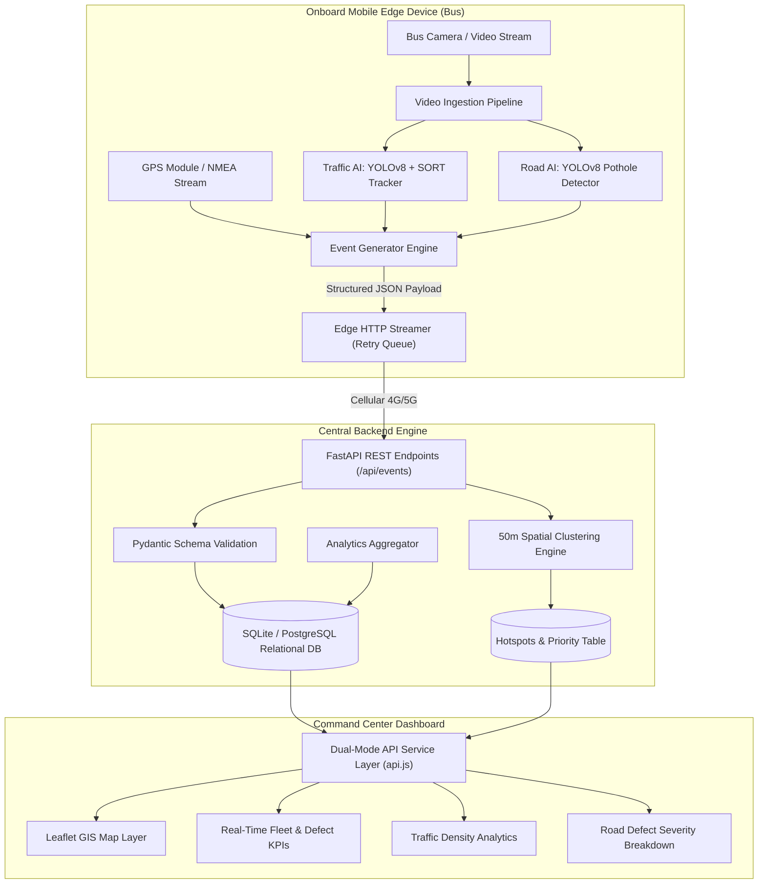

# AI-Powered Mobile Urban Intelligence Platform

> **Smart India Hackathon 2026 (SIH'26)**  
> **Transforming public bus fleets into mobile AI sensing units for real-time traffic monitoring, road defect detection, and intelligent municipal maintenance.**  
> **Live Web Application:** [ai-powered-mobile-urban-intelligenc.vercel.app ↗](https://ai-powered-mobile-urban-intelligenc.vercel.app/)

---

## System Status & Health Matrix

| Subsystem / Module | Status | Technology Stack | Implementation Location | Verified Test State |
|---|---|---|---|---|
| **Traffic AI & Vision** | ✅ COMPLETED | YOLOv8, SORT Kalman Tracker, OpenCV | [`edge-ai/traffic-detection/`](edge-ai/traffic-detection/) | Live HUD, line-crossing counting, density estimation |
| **Road AI (Potholes)** | ✅ COMPLETED | YOLOv8 Defect Detection, Multi-Inference Engine | [`edge-ai/Pothole_Road_Condition_Model/`](edge-ai/Pothole_Road_Condition_Model/) | Video pipeline, width ratio severity scoring, JSONL streams |
| **Backend REST API** | ✅ COMPLETED | FastAPI, SQLAlchemy, Pydantic | [`backend/app/`](backend/app/) | 29/29 Pytest unit & integration tests passing |
| **Spatial Clustering & Intelligence** | ✅ COMPLETED | Haversine 50m Clustering, Priority Formula | [`backend/app/services/hotspot_service.py`](backend/app/services/hotspot_service.py) | Dynamic multi-pass hotspot correlation |
| **Edge Integration & Streamer** | ✅ COMPLETED | Python, GPS Simulator, HTTP Event Client | [`integration/`](integration/) | End-to-end video → AI → GPS → Backend pipeline |
| **GIS Command Center Frontend** | ✅ COMPLETED | React 18, Vite, Tailwind CSS, Leaflet, Recharts | [`frontend/`](frontend/) | Zero build errors; Dual-mode live & demo fallback |
| **Cloud Hosting & Production DB** | 🟡 IN PROGRESS | Vercel (Frontend Live), Render/PostgreSQL (Pending) | [`deployment/`](deployment/) | Frontend deployed; Cloud backend pending (#27) |
| **Continuous Stress Testing** | 🔴 PENDING | 15+ Min Continuous Multi-Stream Testing | [`integration/test_pipeline.py`](integration/test_pipeline.py) | Milestone scheduled for Issue #23 |

---

## 1. Executive Overview

Public transport buses traverse every corner of a city every single day, equipped with dashcams or surveillance hardware whose video feeds remain largely passive and unutilized.

This platform turns city bus fleets into **distributed, mobile edge-sensing networks**. By executing AI inference directly on bus-mounted edge computing devices (such as NVIDIA Jetson or Raspberry Pi units), the system detects road damage (potholes, surface cracks) and traffic congestion in real time. Instead of transmitting high-bandwidth raw video over cellular networks, the edge device transmits lightweight, structured, geo-tagged JSON telemetry to a centralized municipal GIS dashboard.

```
┌─────────────────┐       ┌─────────────────┐       ┌─────────────────┐
│  Bus Dashcams   │ ────► │ Edge AI Compute │ ────► │ Event Generator │
│ (Frontal Video) │       │ (YOLOv8 + SORT) │       │ (+ GPS Telemetry│
└─────────────────┘       └─────────────────┘       └────────┬────────┘
                                                             │ 4G/5G Cellular
                                                             ▼
┌─────────────────┐       ┌─────────────────┐       ┌─────────────────┐
│ Authority Action│ ◄──── │  GIS Command    │ ◄──── │ FastAPI Backend │
│  & Work Orders  │       │ Center (React)  │       │  & Clustering   │
└─────────────────┘       └─────────────────┘       └─────────────────┘
```

---

## 2. Problem Statement & Urban Challenges

Municipalities and transport authorities currently confront severe operational limitations:
1. **Static CCTV Cameras:** Fixed cameras are capital-intensive, require expensive physical maintenance, and leave 95%+ of city road networks uncovered.
2. **Manual Physical Surveys:** Road condition audits happen infrequently (often once every 1–2 years), relying on manual inspections that are slow, labor-intensive, and subjective.
3. **Reactive Citizen Complaints:** Maintenance departments rely on complaint portals, which produce fragmented, unverified, and geographically imprecise reports after damage has already worsened.
4. **Bandwidth & Privacy Bottlenecks:** Streaming 24/7 video from hundreds of transit buses over cellular networks is cost-prohibitive, saturates bandwidth, and presents citizen privacy risks.

---

## 3. The Edge-First Solution & Core Rationale

### Why Edge Computing?
- **99.9% Bandwidth Reduction:** Instead of streaming 2–5 Mbps raw video per bus, the edge processor outputs structured JSON events of ~500 bytes only when an event is detected.
- **Privacy by Design:** Raw video feeds containing citizen faces and private vehicle details are processed and discarded in volatile memory on the bus; zero raw video leaves the vehicle.
- **Low Latency & Scalability:** Real-time detections occur in milliseconds on edge hardware, enabling hundreds of buses to report concurrently to the backend without server overload.
- **Fault-Tolerant Offline Operation:** Edge devices buffer event telemetry locally during cellular dead zones and automatically flush data upon reconnecting.

---

## 4. Key Intelligence & Spatial Clustering Layer

A primary challenge in mobile sensing is preventing transient false positives (e.g., shadows or minor surface discoloration) from generating unnecessary road maintenance work orders. The platform incorporates a **consensus-based intelligence engine**:

### 1. 50-Meter Haversine Spatial Clustering
When a bus reports a road defect (e.g., pothole), the backend spatial clustering service ([`backend/app/services/hotspot_service.py`](backend/app/services/hotspot_service.py)) searches for existing defect records within a 50-meter radius using the Haversine distance formula:
$$d = 2R rcsin\left(\sqrt{\sin^2\left(rac{\Delta\phi}{2}
ight) + \cos(\phi_1)\cos(\phi_2)\sin^2\left(rac{\Delta\lambda}{2}
ight)}
ight)$$

### 2. Multi-Pass Confirmation
- **Single Pass:** Tagged as a transient candidate defect.
- **Multiple Passes (2+ Buses or Repeated Runs):** Escalated to a **Confirmed Hotspot**, verifying persistent physical degradation.

### 3. Dynamic Maintenance Priority Scoring
Hotspots are ranked using a multi-factor priority formula:
$$	ext{Priority Score} = (	ext{Severity Weight} 	imes 0.40) + (	ext{Confirmation Count} 	imes 0.35) + (	ext{Traffic Density Factor} 	imes 0.25)$$

High-severity defects located on high-density transit corridors automatically bubble to the top of municipal repair queues.

---

## 5. System Architecture



---

## 6. Implemented Modules & Capabilities

### A. Traffic AI & Vehicle Tracking (`edge-ai/traffic-detection/`)
- **Model:** YOLOv8 object detector specialized on 4 vehicle classes: `car`, `bus`, `truck`, `motorcycle`.
- **Kalman Tracking:** SORT algorithm associating detections across frames with unique tracking IDs.
- **Directional Counting:** Configurable virtual counting line tracking inbound/outbound transit flows.
- **Density Estimation:** Real-time occupancy categorization (`LOW`, `MEDIUM`, `HIGH`, `CRITICAL`) rendered with a live visual HUD.

### B. Road Condition & Pothole AI (`edge-ai/Pothole_Road_Condition_Model/`)
- **Model:** YOLOv8 road defect detection trained on surface defect datasets.
- **Multi-Approach Inference:** Supports bounding-box ratio severity scoring (Approach A) and grid-based spatial coverage analysis (Approach B).
- **Automated Severity Grading:** Width-to-frame ratio heuristically maps defects to `low`, `medium`, and `high` severity.
- **Continuous Stream Output:** Outputs standardized JSONL event streams matching the central schema.

### C. FastAPI Backend & Database Engine (`backend/app/`)
- **FastAPI Endpoints:**
  - `POST /api/events` — Ingests edge events, validates schemas, triggers clustering.
  - `GET /api/events` — Query events with filters (`event_type`, `severity`, `status`, `bus_id`, pagination).
  - `GET /api/hotspots` — Returns confirmed defect clusters with priority scores.
  - `GET /api/buses` — Fleet tracking and status summary.
  - `GET /api/analytics/summary`, `/api/analytics/traffic`, `/api/analytics/road-conditions` — Aggregated municipal statistics.
- **Database:** SQLAlchemy ORM with auto-migration support for SQLite (local testing) and PostgreSQL (production).
- **Test Suite:** 29 automated test cases covering routing, validation, clustering, and analytics.

### D. Edge Integration & Streamer Layer (`integration/`)
- **GPS Simulation:** Synchronized coordinate and timestamp generation from real-world transit traces (`sample_route.csv`).
- **Standardized Event Generator:** Translates AI detections into strict UTC ISO-8601 JSON schemas.
- **Dual Pipeline Runners:** `run_traffic_pipeline.py` and `run_pothole_pipeline.py` for live edge-to-cloud streaming.

### E. GIS Command Center Frontend (`frontend/`)
- **Technology:** React 18, Vite, Tailwind CSS, Leaflet, Lucide Icons, Recharts.
- **Resilient Dual-Mode API Service:** [`frontend/src/services/api.js`](frontend/src/services/api.js) seamlessly communicates with the local/cloud FastAPI backend and automatically activates a graceful **Demo Fallback Mode** when offline.
- **Pages:** Overview Command Center, Live Fleet Monitoring, GIS Heatmap & Hotspots, Event Detail Modal, Traffic Analytics, and Road Condition Analytics.

---

## 7. Current Project Scope & Non-MVP Boundaries

To maintain focus and high engineering execution for the SIH'26 prototype, the following items are formally designated as **Future Scope** and are **not** implemented in this phase:

- 🔵 **Future Scope:** Automatic Number Plate Recognition (ANPR) & vehicle enforcement
- 🔵 **Future Scope:** Waterlogging and flood depth estimation
- 🔵 **Future Scope:** Missing road sign & divider inventory detection
- 🔵 **Future Scope:** Rash driving, speed calculation, and erratic maneuver tracking
- 🔵 **Future Scope:** Pedestrian near-miss collision warning
- 🔵 **Future Scope:** Urban origin-destination (OD) travel demand matrix

---

## 8. GitHub Issue Tracking & Development Status

### Summary: 22 Resolved (Closed) · 6 In Progress / Open

| Issue ID | Module | Title | Status | Merged PR / Resolution |
|---|---|---|---|---|
| **#1** | AI | `[AI] Vehicle detection and classification prototype` | ✅ Closed | PR #29 |
| **#2** | AI | `[AI] Vehicle counting logic` | ✅ Closed | PR #29 |
| **#3** | AI | `[AI] Traffic density estimation` | ✅ Closed | PR #29 |
| **#4** | ML | `[ML] Select pothole dataset / model` | ✅ Closed | PR #35, #37 |
| **#5** | ML | `[ML] Pothole detection prototype` | ✅ Closed | PR #35, #37 |
| **#6** | ML | `[ML] Confidence and severity scoring logic` | ✅ Closed | PR #35, #37 |
| **#7** | BE | `[BE] Design event database schema` | ✅ Closed | PR #30, #32 |
| **#8** | BE | `[BE] Implement POST /api/events` | ✅ Closed | PR #30, #32 |
| **#9** | BE | `[BE] Implement GET /api/events` | ✅ Closed | PR #30, #32 |
| **#10** | BE | `[BE] Implement analytics endpoints` | ✅ Closed | PR #30, #32 |
| **#11** | BE | `[BE] Implement GET /api/hotspots` | ✅ Closed | PR #30, #32 |
| **#12** | FE | `[FE] Finalize dashboard from existing prototype` | ✅ Closed | Vercel Deployment |
| **#13** | FE | `[FE] Connect GIS map to real event data` | ✅ Closed | PR #33, #34 |
| **#14** | FE | `[FE] Add event detail view (real data)` | ✅ Closed | PR #33, #34 |
| **#15** | FE | `[FE] Add analytics charts and heatmap (real data)` | ✅ Closed | PR #33, #34 |
| **#16** | EDGE | `[EDGE] Video input pipeline` | ✅ Closed | PR #29, #31 |
| **#17** | EDGE | `[EDGE] Event generator (AI -> schema)` | ✅ Closed | PR #29, #31 |
| **#18** | EDGE | `[EDGE] GPS simulation from CSV` | ✅ Closed | PR #31 |
| **#19** | EDGE | `[EDGE] AI-to-backend HTTP integration` | ✅ Closed | PR #31 |
| **#20** | INT | `[INT] First end-to-end pipeline (Video -> Dashboard)` | ✅ Closed | PR #31 |
| **#21** | INT | `[INT] Persistent defect detection logic` | ✅ Closed | PR #32 |
| **#22** | INT | `[INT] Maintenance priority scoring` | ✅ Closed | PR #32 |
| **#23** | INT | `[INT] Full system test` | 🔴 Open | Scheduled: Sept 8 |
| **#24** | DOC | `[DOC] Final README` | 🟡 Open | In Progress / Updated |
| **#25** | DOC | `[DOC] 6-page PPT` | 🔴 Open | Scheduled: Sept 9 |
| **#26** | DOC | `[DOC] Demo video with voiceover` | 🔴 Open | Scheduled: Sept 9 |
| **#27** | DOC | `[DOC] Full stack deployment` | 🔴 Open | Scheduled: Sept 9 |
| **#28** | DOC | `[DOC] Final repository audit` | 🔴 Open | Scheduled: Sept 10 |

---

## 9. Repository Structure

```
AI-Powered-Mobile-Urban-Intelligence/
├── .github/                       # GitHub actions & workflows
├── frontend/                      # React 18 + Vite GIS Command Center
│   ├── src/
│   │   ├── components/            # AlertPanel, MiniMap, KPICard, Header, Sidebar
│   │   ├── pages/                 # Overview, GISMapPage, EventPage, TrafficPage, RoadConditionPage
│   │   ├── services/              # api.js (Dual-mode live backend & demo fallback service)
│   │   ├── data/                  # mockData.js (Centralized synthetic dataset)
│   │   └── index.css              # Tailwind CSS styling
│   └── package.json
├── backend/                       # FastAPI REST API & Database Engine
│   ├── app/
│   │   ├── models/                # Event, Bus, Hotspot, SystemAlert models
│   │   ├── routers/               # /events, /buses, /hotspots, /analytics
│   │   ├── schemas/               # Pydantic data validation schemas
│   │   ├── services/              # hotspot_service.py (50m Haversine clustering & priority)
│   │   ├── config.py              # Settings & environment configuration
│   │   ├── database.py            # SQLAlchemy engine & auto-migration
│   │   └── main.py                # Application entry point & CORS configuration
│   ├── seed_rich.py               # Comprehensive database seeder with realistic coordinates
│   ├── tests/                     # 29 Pytest unit & integration test cases
│   └── requirements.txt
├── edge-ai/
│   ├── traffic-detection/         # Vehicle detection, SORT tracking & density estimation
│   │   ├── detector.py            # YOLOv8 vehicle detection & NMS
│   │   ├── tracker.py             # Kalman filter tracking
│   │   ├── counter.py             # Directional line crossing counter
│   │   ├── density_estimator.py   # Traffic density scoring & live HUD overlay
│   │   ├── pipeline.py            # Video stream processing pipeline
│   │   └── run.py                 # Standalone execution CLI
│   └── Pothole_Road_Condition_Model/ # Pothole detection & severity scoring
│       ├── cloud_training/        # Kaggle/Colab training scripts & notebooks
│       ├── local_training/        # Local PyTorch training pipeline
│       ├── edge_inference/        # Edge-optimized inference engines (Approach A & B)
│       ├── local_inference/       # Local evaluation scripts
│       └── pipeline.py            # Pothole detection pipeline & severity calculation
├── integration/                   # Pipeline Integration & Edge Streamer
│   ├── event-generator/           # Standardized event schema formatter
│   ├── gps/                       # GPS trajectory simulator (sample_route.csv)
│   ├── run_traffic_pipeline.py    # End-to-end Traffic AI streaming runner
│   ├── run_pothole_pipeline.py    # End-to-end Pothole AI streaming runner
│   └── test_pipeline.py           # Smoke test verifying video → AI → backend flow
├── docs/                          # Architecture & technical specifications
│   ├── api/event-schema.md        # Single source of truth for JSON event contract
│   ├── architecture/              # System architecture & integration layer specs
│   ├── models/traffic-ai.md       # Traffic AI model documentation & benchmarks
│   ├── development-status.md      # Detailed module status log
│   └── project-board.md           # Task board & issue resolution mapping
├── presentation/                  # SIH 6-page presentation deck placeholder
├── demo/                          # Demo video & recordings placeholder
├── deployment/                    # Cloud deployment manifests
├── CONTRIBUTING.md                # Git collaboration workflow & commit standards
├── LICENSE                        # Open source MIT license
└── requirements.txt               # Root dependencies
```

---

## 10. Quick Start & Execution Guide

### Prerequisites
- Python 3.10+
- Node.js 18+ and npm
- Git

### 1. Run Frontend GIS Command Center
```bash
cd frontend
npm install
npm run dev
```
Open **[http://localhost:5173](http://localhost:5173)**. If the backend is not running, the dashboard automatically operates in **Demo Fallback Mode**.

### 2. Run Backend API & Database
```bash
cd backend
pip install -r requirements.txt

# Seed the database with realistic fleet and event data:
python seed_rich.py

# Start the FastAPI server:
uvicorn app.main:app --reload --port 8000
```
- **API Documentation (Swagger UI):** [http://localhost:8000/docs](http://localhost:8000/docs)
- **Health Check:** [http://localhost:8000/health](http://localhost:8000/health)
- **Run Backend Tests:** `pytest backend/tests` (29 passed)

### 3. Run Standalone Traffic AI
```bash
cd edge-ai/traffic-detection
pip install -r requirements.txt
python run.py --source 0 --show
```

### 4. Run Full End-to-End Live Streamer
```bash
# With FastAPI backend running at localhost:8000:
python integration/run_traffic_pipeline.py --source 0 --backend-url http://localhost:8000/api/events --bus-id BUS-001
```

---

## 11. Team & Contribution Matrix

| Member | Domain Ownership | Primary Deliverables | Current Status |
|---|---|---|---|
| **Pranav** | Traffic AI / Computer Vision | YOLOv8 vehicle detection, SORT tracking, counting, density HUD | ✅ Complete (PR #29) |
| **Abhinandan** | Road AI / Defect Detection | YOLOv8 pothole model, multi-approach inference, severity scoring | ✅ Complete (PR #35, #37) |
| **Arjun** | Backend & Database Engine | FastAPI REST API, SQLAlchemy DB, 50m spatial clustering service | ✅ Complete (PR #30, #32) |
| **Parminder** | Edge Integration & Streaming | GPS simulator, standardized EventGenerator, pipeline runners | ✅ Complete (PR #31, #37) |
| **Advika** | Frontend & GIS Dashboard | React dashboard, dual-mode API service, Leaflet GIS integration | ✅ Complete (PR #33, #34) |
| **Team Lead** | System Coordination & Docs | System architecture, test suites, SIH submission deliverables | 🟡 In Progress (#23–#28) |

---

## 12. License

Distributed under the MIT License. See [`LICENSE`](LICENSE) for more details.
