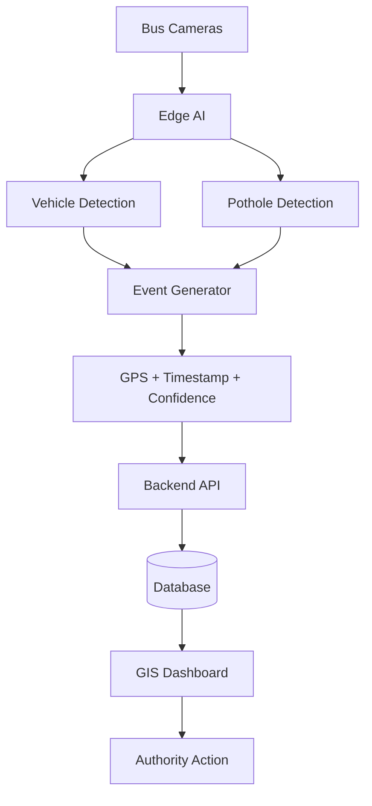

# AI-Powered Mobile Urban Intelligence Platform

> **SIH'26** · Smart India Hackathon 2026  
> **Status:** Active Development · [Live Frontend Prototype ↗](https://ai-powered-mobile-urban-intelligenc.vercel.app/)

---

## Overview

Public transport buses already travel throughout every part of a city, every single day. They carry cameras — but that video is almost entirely unused for urban sensing.

This platform transforms the existing public bus fleet into a **network of mobile AI-powered sensing units**. Bus-mounted cameras are processed using edge AI to detect road defects, traffic conditions, and other urban events. Each detection becomes a structured, geo-tagged event that is sent to a central dashboard where transport and municipal authorities can act on it.

---

## Problem

City authorities currently depend on:
- **Fixed CCTV cameras** — expensive, sparse, limited coverage
- **Manual road surveys** — infrequent, slow, costly
- **Citizen complaints** — reactive, incomplete, no geographic accuracy

There is no system for **continuous, city-wide, automated road and traffic sensing** at scale.

---

## Solution

Use the buses that are already on the road.

```
Bus Camera
    ↓
Edge AI  (runs directly on the bus device)
    ↓
Vehicle Detection / Pothole Detection
    ↓
Event Generation
    ↓
GPS + Timestamp + Confidence
    ↓
Backend API  (cellular uplink)
    ↓
Database
    ↓
GIS Dashboard + Analytics
    ↓
Authority Action
```

By running AI inference **on the bus**, only small structured JSON events (not raw video) are sent over the network, making the system practical even over 4G.

---

## Current MVP

The following are the features being built for SIH'26:

| # | Feature | Area |
|---|---------|------|
| 1 | Vehicle detection and classification | Traffic AI |
| 2 | Vehicle counting | Traffic AI |
| 3 | Traffic density / congestion estimation | Traffic AI |
| 4 | Pothole detection | Road AI |
| 5 | Road defect detection | Road AI |
| 6 | GPS + timestamp + confidence event generation | Integration |
| 7 | Centralized backend + REST API | Backend |
| 8 | Persistent / repeated defect detection | Backend |
| 9 | GIS dashboard with event markers | Frontend |
| 10 | Analytics and heatmaps | Frontend |
| 11 | Maintenance priority scoring | Backend |

---

## Key Intelligence Layer

Beyond simple detection, this platform implements a concept called **persistent detection**:

- Multiple buses independently detect the **same pothole or road defect** on different passes
- The system cross-references GPS coordinates across detections
- A location that is repeatedly flagged across multiple buses is treated as a **confirmed hotspot**
- These hotspots generate higher-priority maintenance alerts

This gives authorities **confidence levels based on consensus**, not just a single observation.

**Why edge processing?**
- Reduces bandwidth: buses send small JSON events, not video streams
- Lower latency: events are generated immediately on detection
- Scales with fleet size without requiring central video infrastructure
- Preserves privacy: raw video does not leave the bus

---

## Future Scope

These features are **NOT** part of the current MVP and will not be implemented for SIH'26:

- Waterlogging detection
- Traffic-sign detection
- Missing zebra crossings / dividers
- Pedestrian-risk detection
- Rash driving detection
- ANPR (Automatic Number Plate Recognition)
- Hit-and-run incident reporting
- Origin–destination analysis
- Advanced route prediction

---

## Development Status

| Module | Status | Notes |
|--------|--------|-------|
| Project Setup | ✅ Complete | Repo, structure, docs |
| Frontend Prototype | ✅ Complete | Deployed on Vercel, mock data |
| Traffic AI | 🟡 In Progress | Vehicle detection + counting |
| Road Damage AI | 🟡 In Progress | Pothole detection model |
| Event Engine | 🟡 Planned | AI → structured event generator |
| Backend | 🟡 Planned | REST API + event processing |
| Database | 🟡 Planned | Event + analytics storage |
| GIS Integration | 🟡 Planned | Frontend ↔ Backend connection |
| Prototype Deployment | 🟡 Planned | Full stack deployment |

---

## Live Prototype

🔗 **[https://ai-powered-mobile-urban-intelligenc.vercel.app/](https://ai-powered-mobile-urban-intelligenc.vercel.app/)**

> ⚠️ This is the current **frontend-only prototype** running on **mock/synthetic data**.  
> No real buses, cameras, AI models, or backend are connected yet.  
> It demonstrates the intended UI/UX and data model for the final system.

---

## Architecture

### Prototype (for SIH demo)

```
Recorded Road / Bus Video
        ↓
Laptop / PC  (simulated edge device)
        ↓
AI Inference  (YOLO / custom model)
        ↓
Event Generation  (Python script)
        ↓
Backend API  (FastAPI / Flask)
        ↓
Database  (PostgreSQL / SQLite)
        ↓
GIS Dashboard  (React + Leaflet)
```

### Intended Deployment

```
Bus Cameras
        ↓
Edge Compute Device  (Jetson Nano / RPi)
        ↓
4G / 5G Network
        ↓
Central Backend Platform
        ↓
GIS Dashboard → Authority Action
```

### Architecture Diagram



---

## Repository Structure

```
AI-Powered-Mobile-Urban-Intelligence/
├── frontend/               # React + Vite GIS dashboard (Tailwind, Leaflet, Recharts)
│   └── src/
│       ├── pages/          # Overview, LiveMonitoring, Events, GIS Map, Analytics
│       ├── components/     # AlertPanel, MiniMap, KPI Cards
│       ├── data/           # mockData.js  ← replace with API calls later
│       └── services/       # api.js  ← service layer ready for backend
├── edge-ai/
│   ├── traffic-detection/  # Vehicle detection + counting + density (Pranav)
│   └── pothole-detection/  # Pothole + road defect detection (Abhinandan)
├── backend/
│   ├── api/                # REST API (Arjun)
│   ├── database/           # Schema + migrations (Arjun)
│   └── models/             # DB models / ORM
├── integration/
│   ├── event-generator/    # AI output → structured event (Parminder)
│   └── gps/                # GPS simulation / real GPS integration
├── datasets/               # Training datasets (not committed — see .gitignore)
├── docs/
│   ├── api/                # Event schema + API contracts
│   ├── architecture/       # System architecture documentation
│   └── project-management.md
├── demo/                   # Demo videos, screenshots, evidence
├── presentation/           # SIH PPT
├── deployment/             # Docker, Vercel config, cloud deployment
├── CONTRIBUTING.md         # Branch strategy + workflow
└── requirements.txt        # Python dependencies
```

---

## Team

> These are **initial suggested ownership areas**. Members may collaborate, split tasks, or exchange responsibilities based on workload and interest. What matters is that every deliverable has a clear owner.

| Member | Primary Area |
|--------|-------------|
| **Pranav** | Traffic AI / Computer Vision |
| **Abhinandan** | ML / Road-Damage AI |
| **Arjun** | Backend / Database |
| **Advika** | Frontend / GIS |
| **Parminder** | Edge AI / Integration |
| **Team Lead** | System Integration · Architecture · Coordination · Documentation · Submission |

---

## Submission Requirements

| Item | Status |
|------|--------|
| GitHub Repository | ✅ This repo |
| 6-page PPT | 🟡 Planned |
| Demo video with voiceover | 🟡 Planned |
| Hardware / circuit documentation | 🟡 If applicable |
| Live deployment | 🟡 Frontend prototype live, full stack planned |
| Additional resources / documentation | 🟡 In progress |

---

## Getting Started (Frontend)

```bash
cd frontend
npm install
npm run dev
```

Open [http://localhost:5173](http://localhost:5173)

> See [`frontend/README.md`](frontend/README.md) for full frontend setup.  
> Backend and edge AI setup instructions will be added as those modules are developed.

