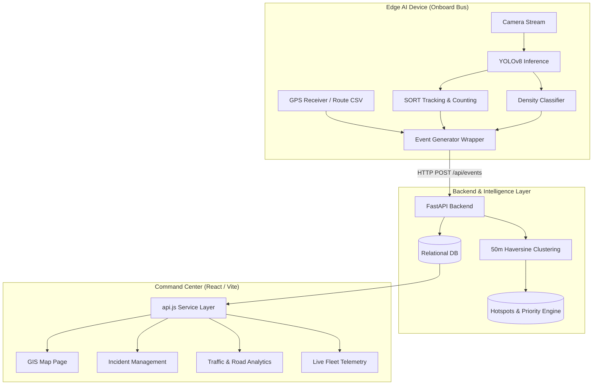

# AI-Powered Mobile Urban Intelligence Platform

> **SIH'26** · Smart India Hackathon 2026  
> **Status:** Active Development · [Live Frontend Prototype ↗](https://ai-powered-mobile-urban-intelligenc.vercel.app/)

---

## 1. Project Overview

Public transit buses navigate every sector of a modern city on daily scheduled routes. While many transit vehicles carry onboard cameras, their visual streams remain almost entirely unutilized for proactive municipal sensing.

This platform transforms the public bus fleet into an **autonomous, distributed network of mobile AI sensing units**. Edge AI models process front-facing camera streams directly on the vehicle to detect road hazards (potholes, surface defects) and traffic conditions (congestion, vehicle counts). Detections are converted into structured, lightweight, geo-tagged JSON telemetry events and transmitted to a centralized command center for municipal action and urban planning.

```
┌─────────────────┐       ┌─────────────────┐       ┌────────────────────────┐
│ Bus Camera Feed │ ────> │   Edge AI Unit  │ ────> │ Structured Event JSON  │
└─────────────────┘       │ (YOLOv8 + SORT) │       │ (GPS + Time + Density) │
                          └─────────────────┘       └────────────────────────┘
                                                                 │ (4G/5G Uplink)
                                                                 ▼
┌─────────────────────────┐       ┌─────────────────┐       ┌────────────────────────┐
│  Municipal GIS Actions  │ <──── │   GIS Dashboard │ <──── │   FastAPI Backend & DB │
│ (Repair Work Orders)    │       │  & Analytics UI │       │ (50m Spatial Cluster)  │
└─────────────────────────┘       └─────────────────┘       └────────────────────────┘
```

---

## 2. Problem Statement

Modern municipal and traffic management authorities face fundamental sensing bottlenecks:

- **Fixed CCTV Cameras:** High capital and maintenance expenditure, stationary field-of-view, sparse suburban coverage.
- **Manual Road Surveys:** Slow, labor-intensive, conducted at intervals of months or years.
- **Citizen Grievances:** Reactive, biased reporting, missing standardized spatial coordinates or severity classification.

**Our Approach:** Utilize the transit fleet already driving city streets to achieve automated, continuous, city-wide mobile surveillance at zero incremental vehicular deployment cost.

---

## 3. Core MVP Features & Status

| # | Feature Area | Description | Status |
|---|---|---|---|
| 1 | **Vehicle Detection & Counting** | YOLOv8 multi-class detection (`car`, `bike`, `bus`, `truck`) with SORT Kalman tracking and directional tripwire counting | ✅ Complete (PR #29) |
| 2 | **Traffic Density Estimation** | Dynamic density scoring formulation (`LOW`, `MEDIUM`, `HIGH`, `CRITICAL`) with real-time video HUD overlays | ✅ Complete (PR #29) |
| 3 | **Pothole & Road Defect AI** | Road hazard detection and severity classification from surface video | 🟡 In Progress (#4, #5, #6) |
| 4 | **Edge Event Generator** | Normalization of AI detections into standardized JSON events with simulated GPS and ISO UTC timestamps | ✅ Complete (PR #31) |
| 5 | **Backend REST API Engine** | High-performance FastAPI server with Pydantic v2 schemas and query-filterable endpoints | ✅ Complete (PR #30, #32) |
| 6 | **Spatial Hotspot Clustering** | 50-meter Haversine spatial clustering algorithm (`hotspot_service.py`) detecting persistent multi-bus hazards | ✅ Complete (PR #32) |
| 7 | **Maintenance Priority Engine** | Formulaic scoring: $\text{Priority Score} = f(\text{Severity}, \text{Repeat Count}, \text{Traffic Density})$ | ✅ Complete (PR #32) |
| 8 | **GIS Urban Dashboard** | Interactive Leaflet map with real geo-tagged event pins, cluster circles, and search/filter tools | ✅ Complete (PR #33, #34) |
| 9 | **Interactive Telemetry Analytics** | Recharts visualizations for 24h traffic density curves, vehicle classification, defect severity, and trends | ✅ Complete (PR #33, #34) |
| 10 | **Dual-Mode Data Gateway** | Seamless live API mode with automatic, graceful fallback to local mock store when offline | ✅ Complete (PR #33, #34) |
| 11 | **Public Cloud Backend Deploy** | Cloud hosting for FastAPI + managed PostgreSQL instance | 🟡 Planned (#27) |
| 12 | **End-to-End Stress Testing** | Continuous multi-hour video dataset stress validation | 🟡 In Progress (#23) |

---

## 4. Current Implementation Status

```
✅ Completed     🟡 In Progress     🔴 Pending     🔵 Future Scope
```

- ✅ **Traffic AI Module:** YOLOv8 detection, SORT tracking, line counting, and density estimation ([`docs/models/traffic-ai.md`](docs/models/traffic-ai.md)).
- ✅ **Backend Engine:** FastAPI REST endpoints, SQLAlchemy ORM, SQLite local auto-migrations, 50m spatial clustering service ([`backend/app/`](backend/app/)).
- ✅ **Integration Layer:** GPS route simulator (`sample_route.csv`), `EventGenerator`, HTTP client, and pipeline runner ([`docs/architecture/integration-layer.md`](docs/architecture/integration-layer.md)).
- ✅ **Frontend & GIS:** React/Vite dashboard, Leaflet GIS map, Recharts analytics, incident management with status updates, dual-mode Live/Demo operation ([`frontend/src/`](frontend/src/)).
- 🟡 **Road Defect AI:** Pothole dataset selection and model training benchmark in `edge-ai/pothole-detection/` (Active tasks: #4, #5, #6).
- 🟡 **Cloud Deployment:** Live frontend hosted on Vercel; public cloud FastAPI + PostgreSQL deployment scheduled (#27).
- 🔴 **Submission Assets:** SIH 6-page PPT deck (#25) and demo video with voiceover (#26).
- 🔵 **Future Scope:** Waterlogging detection, ANPR, traffic sign inventory, pedestrian hazard identification, erratic driving analysis.

---

## 5. System Architecture & Edge Intelligence

### Edge-First Processing Rationale

1. **Bandwidth Optimization:** Transmitting continuous 1080p video from 100 buses would require >200 Mbps of continuous cellular bandwidth. By running inference at the edge, each vehicle transmits lightweight JSON payloads (~1 KB) only upon detection.
2. **Privacy by Design:** Raw footage containing civilian faces or vehicle license plates is processed in volatile memory on the edge device and immediately discarded.
3. **Consensus-Based Spatial Verification:** A single pothole detection is treated as unverified until multiple independent bus passes register coordinates within a 50-meter radius, eliminating transient false positives.



---

## 6. Backend & Database Architecture

### Local Development vs Production

- **Local Development:** SQLite database at `backend/urban_intelligence.db` (gitignored). Auto-created and migrated on startup. Rich test data populated via `python seed_rich.py`.
- **Production Support:** SQLAlchemy connection string configured via `DATABASE_URL` in `backend/.env`. Compatible with PostgreSQL (Supabase / Railway / AWS RDS) without application code changes.

### Key API Endpoints

| Method | Endpoint | Description |
|---|---|---|
| `GET` | `/health` | Service health status check |
| `POST` | `/api/events` | Ingest edge AI detection event (enforces `confidence >= 0.65`) |
| `GET` | `/api/events` | List events with filters (`event_type`, `severity`, `status`, `bus_id`, `search`, `limit`, `offset`) |
| `GET` | `/api/events/{id}` | Retrieve single event metadata and captured evidence |
| `PATCH` | `/api/events/{id}/status` | Update incident status (`new` → `under_review` → `verified` → `resolved`) |
| `GET` | `/api/buses` | Fleet listing with last reported GPS position and traffic condition |
| `GET` | `/api/hotspots` | Persistent detection clusters ordered by calculated priority score |
| `GET` | `/api/alerts` | System alerts for the Command Center alert panel |
| `PATCH` | `/api/alerts/{id}/acknowledge` | Mark system alert as acknowledged |
| `GET` | `/api/analytics/summary` | KPI metrics for overview dashboard |
| `GET` | `/api/analytics/traffic` | Traffic density curve (24h) and vehicle classification breakdown |
| `GET` | `/api/analytics/traffic/summary` | Top-level traffic KPI summaries |
| `GET` | `/api/analytics/road` | Defect severity distribution and 7-day reporting trend |
| `GET` | `/api/analytics/road/summary` | Top-level road condition summaries |

---

## 7. Frontend & GIS Dashboard

The frontend is a single-page application built with React, Vite, Tailwind CSS, Leaflet, and Recharts.

### Key Capabilities

1. **Platform Overview (`/`):** Real-time KPI summary cards, mini-map preview, and acknowledgeable alert panel.
2. **Live Fleet Monitoring (`/live`):** Real-time transit bus roster, simulated front-camera HUD stream, and telemetry status.
3. **Incident Management (`/events`):** Filterable incident table with search, detailed inspection modal, and interactive workflow status changer.
4. **GIS Urban Intelligence Map (`/map`):** Full-screen Leaflet map displaying geo-tagged event pins, persistent hotspot clusters, and heatmap overlay.
5. **Traffic Intelligence Analytics (`/traffic`):** 24-hour density area chart, vehicle category pie chart, and live bus route congestion delay cards.
6. **Road Condition Analytics (`/road-conditions`):** Severity distribution bar chart and 7-day defect trend visualization.
7. **Dual-Mode Gateway (`frontend/src/services/api.js`):**
   - **Live API Mode:** Fetches from `VITE_API_BASE_URL` with a 3.5s timeout.
   - **Automatic Demo Fallback:** If the backend is unreachable or `VITE_USE_MOCK_DATA=true`, gracefully falls back to local synthetic data without infinite loading states.
   - **Interactive Switcher:** Toggle data mode on the fly via the Settings gear icon in the navigation header.

---

## 8. Local Setup & Installation

### Prerequisites

- **Python:** 3.10 – 3.14
- **Node.js:** 18+ and npm
- **Git**

---

### Step 1: Clone Repository

```bash
git clone https://github.com/amulyaverse/AI-Powered-Mobile-Urban-Intelligence.git
cd AI-Powered-Mobile-Urban-Intelligence
```

---

### Step 2: Backend Setup & Seeding

```bash
cd backend

# Create virtual environment
python3 -m venv venv
source venv/bin/activate   # On Windows: venv\Scripts\activate

# Install dependencies
pip install -r requirements.txt

# Configure environment
cp .env.example .env

# Seed database with realistic transit fleet and Delhi NCR event clusters
python seed_rich.py

# Start FastAPI server
uvicorn app.main:app --reload --port 8000
```

- API Docs (Swagger UI): **[http://localhost:8000/docs](http://localhost:8000/docs)**
- Health Check: **[http://localhost:8000/health](http://localhost:8000/health)**

---

### Step 3: Frontend Dashboard Setup

In a new terminal window:

```bash
cd frontend

# Install Node dependencies
npm install

# Configure environment
cp .env.example .env

# Start Vite development server
npm run dev
```

Open **[http://localhost:5173](http://localhost:5173)** in your browser.

---

### Step 4: Run Traffic AI & End-to-End Streamer (Optional)

In a third terminal window:

```bash
# Standalone Traffic AI HUD runner:
cd edge-ai/traffic-detection
pip install -r requirements.txt
python run.py --source 0 --show

# Or run the live End-to-End Streamer (AI + GPS -> Backend API):
# (from project root)
python integration/run_traffic_pipeline.py \
  --source 0 \
  --backend-url http://localhost:8000/api/events \
  --bus-id BUS_021
```

---

## 9. Environment Variables Reference

### Backend (`backend/.env`)

| Variable | Default Value | Description |
|---|---|---|
| `DATABASE_URL` | `sqlite:///./urban_intelligence.db` | SQLAlchemy database connection string |
| `DEBUG` | `true` | Enable debug logs |
| `ALLOWED_ORIGINS` | `http://localhost:5173,http://127.0.0.1:5173,http://localhost:3000,http://127.0.0.1:3000,https://ai-powered-mobile-urban-intelligenc.vercel.app` | Comma-separated CORS allowed origins |
| `MIN_CONFIDENCE` | `0.65` | Minimum AI confidence required for ingestion |
| `HOTSPOT_RADIUS_METRES` | `50.0` | Spatial clustering distance threshold |
| `HOTSPOT_ALERT_THRESHOLD` | `3` | Detections needed to trigger a system alert |

### Frontend (`frontend/.env`)

| Variable | Default Value | Description |
|---|---|---|
| `VITE_API_BASE_URL` | `http://localhost:8000` | Target FastAPI backend URL |
| `VITE_USE_MOCK_DATA` | `false` | Force demo mode without network calls |

---

## 10. Testing & Verification

### Backend Automated Test Suite

Run unit and integration tests covering events, validation, hotspot clustering, and analytics endpoints:

```bash
cd backend
pytest tests
```

- **Result:** 29 passed in ~1.0s.

### Frontend Production Build Test

Verify that all React components, Tailwind styling, and TypeScript/ESLint rules compile cleanly:

```bash
cd frontend
npm run build
```

- **Result:** Vite build passed with zero compilation errors (`dist/` generated).

---

## 11. Team & Project Responsibilities

| Member | Focus Area | Core Responsibilities | Implementation Status |
|---|---|---|---|
| **Pranav** | Traffic AI / Vision | Vehicle detection, counting, SORT tracker, density estimator | ✅ Complete (PR #29) |
| **Arjun** | Backend & Database | FastAPI REST engine, DB schema, 50m spatial clustering, analytics | ✅ Complete (PR #30, #32) |
| **Parminder** | Edge AI & Integration | GPS route simulator, standardized EventGenerator, pipeline runner | ✅ Complete (PR #31) |
| **Advika** | Frontend & GIS | Command center, GIS map, Recharts telemetry, dual-mode service | ✅ Complete (PR #33, #34) |
| **Abhinandan** | ML / Road-Damage AI | Pothole detection, road defect classification & severity scoring | 🟡 In Progress (#4, #5, #6) |
| **Team Lead** | System Architecture | Architecture, integration testing, project coordination, submission | 🟡 In Progress (#23–#28) |

---

## 12. Known Limitations

1. **Road Defect AI Model:** Pothole model training on RDD2022 dataset is currently underway; road defect events in the local database are currently supplied via the rich seed and GPS simulation runner.
2. **Cloud Backend Hosting:** While the frontend is live on Vercel, the backend is currently run locally for development; public deployment on cloud infrastructure is scheduled under task #27.
3. **Simulated GPS in Lab Tests:** In the absence of physical hardware onboard active Delhi DTC buses during lab testing, GPS trajectories are supplied via synchronized CSV playback (`sample_route.csv`).

---

## 13. Documentation Index

- **[Event Schema Contract](docs/api/event-schema.md)** — Standardized JSON schema for mobile telemetry events.
- **[System Architecture](docs/architecture/system-architecture.md)** — Comprehensive architecture specification and edge rationale.
- **[Integration Layer Guide](docs/architecture/integration-layer.md)** — End-to-end pipeline runner and GPS simulation details.
- **[Traffic AI Module Documentation](docs/models/traffic-ai.md)** — Full parameters, tracker mechanics, and HUD specs.
- **[Development Status](docs/development-status.md)** — Module completion tracking and next deliverables.
- **[Project Board & Task Tracker](docs/project-board.md)** — All 28 project tasks mapped to GitHub issues and PRs.
- **[Contributing Guidelines](CONTRIBUTING.md)** — Git branch rules and pull request standards.

---

## 14. License

Distributed under the MIT License. See [`LICENSE`](LICENSE) for details.
