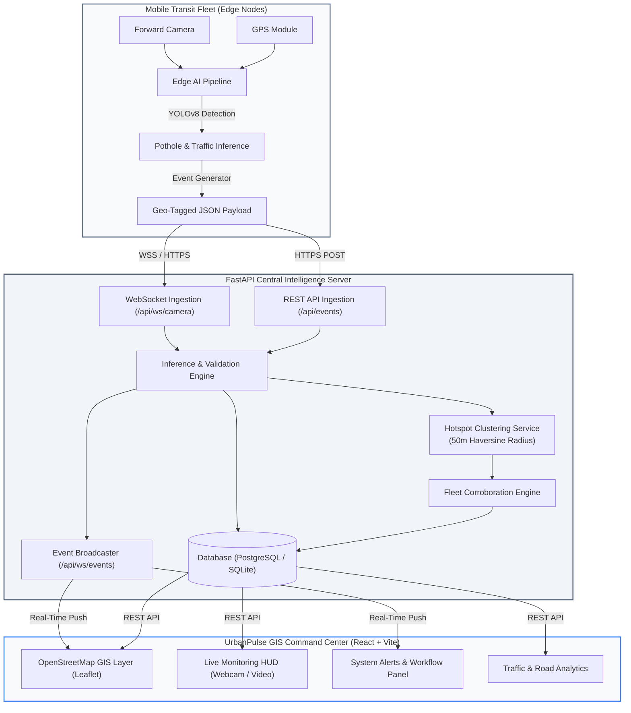

# UrbanPulse

**AI-Powered Mobile Urban Intelligence Platform Using Public Transport Fleet**  
*Turning public buses into a distributed urban sensing network.*

[](backend/tests/)
[](frontend/)
[](frontend/src/pages/GISMapPage.jsx)
[](LICENSE)

---

## 1. Overview

**UrbanPulse** is an AI-powered municipal intelligence platform that transforms standard public transit fleets (city buses) into mobile edge-sensing units. By mounting forward-facing cameras and GPS sensors on public buses, the system continuously analyzes road surfaces and traffic conditions during regular route operations.

Edge-detected road defects (potholes, surface cracks) and traffic anomalies (vehicle counts, congestion density) are converted into compact, geo-tagged event payloads containing coordinates, timestamps, confidence scores, and visual evidence. These events are transmitted to a central FastAPI backend, persisted in a database, and rendered on an interactive OpenStreetMap GIS Command Center.

When multiple buses independently record defects at the same physical location, UrbanPulse performs **Fleet Corroboration**, aggregating individual detections into **Persistent Hotspot Clusters** to assign actionable **Maintenance Priority Scores** for municipal road management.

```
Public Transit Bus
       ↓ (Camera + GPS)
Mobile Edge AI (YOLOv8)
       ↓ (Geo-Tagged Event)
FastAPI Backend & Database
       ↓ (Spatial Clustering & Aggregation)
City GIS Command Center
       ↓ (Fleet Corroboration)
Maintenance Priority & Municipal Action
```

---

## 2. Problem & Solution

### The Urban Infrastructure Challenge
- **Manual Road Surveys**: Municipal road inspection traditionally relies on manual survey vehicles or citizen complaint portals, which are slow, reactive, and costly to cover an entire metropolitan grid.
- **Static Traffic Monitoring**: Fixed traffic cameras only monitor specific intersections, leaving transit corridors and suburban feeder roads unobserved.
- **Bandwidth Constraints**: Continuous raw video transmission from hundreds of buses over cellular networks (4G/5G) is expensive and bandwidth-prohibitive.

### The UrbanPulse Approach
- **Passive Mobile Sensing**: Public buses run daily fixed routes covering hundreds of kilometers across urban centers, offering continuous spatial sampling without deploying dedicated survey crews.
- **Edge-First Event Processing**: Video frames are analyzed directly on the vehicle or edge node; only lightweight JSON event records with metadata and snapshot evidence are transmitted.
- **Fleet Corroboration**: A single transient detection is treated with caution; repeated detections across multiple distinct buses at the same coordinates confirm genuine structural defects.

---

## 3. System Architecture



---

## 4. Current Core Features (MVP)

| Feature | Description | Status |
|---|---|---|
| **Vehicle Detection & Counting** | YOLOv8 multi-class vehicle detection (cars, motorcycles, buses, trucks) with directional density estimation. | ✅ Implemented |
| **Pothole & Road Defect AI** | Custom-trained YOLOv8 road condition model (`best_2.pt`) for defect localization and severity classification. | ✅ Implemented |
| **Geo-Tagged Event Generation** | Real-time creation of standardized JSON events with GPS coordinates, timestamps, and confidence scores. | ✅ Implemented |
| **FastAPI REST & WebSocket Backend** | Endpoints for event ingestion, fleet management, spatial clustering, range video streaming, and real-time broadcasting. | ✅ Implemented |
| **OpenStreetMap GIS Dashboard** | React Leaflet map displaying active detection markers, bus fleet locations, and persistent defect zones without external API keys. | ✅ Implemented |
| **Persistent Hotspot Clusters** | Geospatial 50m Haversine clustering identifying recurring road defects across transit corridors. | ✅ Implemented |
| **Fleet Corroboration** | Multi-bus verification counter (`2×`, `3×`, `6×`) escalating confidence and maintenance urgency. | ✅ Implemented |
| **Maintenance Priority Scoring** | Deterministic score ($Count \times AvgConfidence \times SeverityWeight$) assisting municipal repair scheduling. | ✅ Implemented |
| **Live Monitoring Suite** | In-browser camera/video inference workbench with bounding-box overlays, FPS counters, and latency monitoring. | ✅ Implemented |
| **Bidirectional Alert-Map Focus** | Clicking an alert card or "Focus Map" button centers and zooms the GIS map to the incident location. | ✅ Implemented |

---

## 5. AI / Computer Vision & Model Benchmarks

The UrbanPulse edge layer employs two specialized computer vision pipelines:

### 1. Traffic Intelligence Pipeline
- **Base Architecture**: YOLOv8 Nano (`yolov8n.pt`)
- **Classes**: Car, Motorcycle/Bike, Bus, Truck (COCO 80-class subset)
- **Output**: Total vehicle count, vehicle class breakdown, traffic density classification (`LOW`, `MEDIUM`, `HIGH`, `CRITICAL`), and area coverage ratio.

### 2. Road Defect & Pothole AI Pipeline
- **Model Weights**: `edge-ai/pothole-latest/Pothole_Road_Condition_Model/best_2.pt`
- **Trained Classes**: `pothole`, `crack`, `severe_crack`
- **Severity Classification**: Evaluated via bounding box width heuristic and area ratio relative to frame geometry.
- **Verified Evaluation Metrics**:

$$\text{Precision: } 84.2\% \quad\vert\quad \text{Recall: } 78.9\% \quad\vert\quad \text{mAP@50: } 81.6\%$$

```
Raw Video Frame (640×480)
       ↓
YOLOv8 Defect Inference (best_2.pt)
       ↓
Bounding Box Extraction [x1, y1, x2, y2]
       ↓
Width & Area Ratio Heuristic Calculation
       ↓
Severity Assignment (LOW / MEDIUM / HIGH / CRITICAL)
```

---

## 6. GIS Intelligence & Visualization

The UrbanPulse GIS dashboard ([`frontend/src/pages/GISMapPage.jsx`](frontend/src/pages/GISMapPage.jsx)) is built using **Leaflet** and **React-Leaflet** on top of the **OpenStreetMap** tile layer, requiring no proprietary API keys:

- **Tile Provider**: `https://{s}.tile.openstreetmap.org/{z}/{x}/{y}.png`
- **Attribution**: `© OpenStreetMap contributors`
- **Strict GPS Validation**: Coordinates are validated as genuine numeric latitudes ($-90$ to $+90$) and longitudes ($-180$ to $+180$). Events without valid coordinates are omitted from the map layer to preserve data integrity.

### GIS Layer Structure:
1. **Incident Detections Layer**:
   - **Potholes / Road Defects**: Color-coded by severity (Critical/High = Red `#ef4444`, Medium = Amber `#f59e0b`, Low = Emerald `#10b981`).
   - **Traffic Congestion**: Distinct Slate-Blue (`#3b82f6`) marker with vehicle icon.
   - **Pulsing Aura**: Applied to critical incidents and user-selected markers.
2. **Persistent Hotspot Clusters**:
   - Semi-transparent spatial circles centered on cluster centroids.
   - Circle radius scales dynamically with observation count ($r = 80\text{m} + \text{count} \times 30\text{m}$).
3. **Active Mobile Bus Fleet Layer**:
   - Indigo badge markers displaying Bus IDs (e.g., `BUS_021`), assigned routes, camera operating status, and last reported traffic level.

---

## 7. Fleet Corroboration & Maintenance Priority

### Fleet Corroboration Concept
```
Bus BUS_021 detects Pothole at (28.6289, 77.2150)
                 +
Bus BUS_014 detects Pothole at (28.6288, 77.2151) [10 mins later]
                 +
Bus BUS_008 detects Pothole at (28.6290, 77.2149) [1 hour later]
                 ↓
      Fleet Corroboration (3×)
                 ↓
    Persistent Road Defect Hotspot
                 ↓
     Elevated Maintenance Priority
```

### Hotspot Matching & Scoring Logic
When a new road defect event is ingested, the backend hotspot service ([`backend/app/services/hotspot_service.py`](backend/app/services/hotspot_service.py)) performs a 50-meter Haversine distance check against existing active hotspots:
1. **Matching Radius**: 50.0 metres (`HOTSPOT_RADIUS_METRES`).
2. **Centroid Update**: Updates the cluster centroid as the running average of contributing observations.
3. **Severity Escalation**:
   - $\ge 2$ observations $\rightarrow$ `medium`
   - $\ge 4$ observations $\rightarrow$ `high`
   - $\ge 6$ observations $\rightarrow$ `critical`
4. **Maintenance Priority Score Calculation**:
   $$\text{Priority Score} = \text{Detection Count} \times \text{Average Confidence} \times \text{Severity Weight}$$
   *(Weights: $\text{Low} = 1.0$, $\text{Medium} = 2.0$, $\text{High} = 3.5$, $\text{Critical} = 5.0$)*
5. **Automated Alert Generation**: When a hotspot crosses the threshold ($\ge 3$ observations), a `SystemAlert` is generated for municipal action.

---

## 8. Event Schema (JSON Contract)

All edge nodes, backend services, and GIS components adhere to a standardized event schema:

```json
{
  "event_id": "EVT_PR37_001",
  "event_type": "pothole",
  "confidence": 0.92,
  "severity": "high",
  "bus_id": "BUS_021",
  "camera_id": "CAM_FRONT",
  "latitude": 28.628900,
  "longitude": 77.215000,
  "timestamp": "2026-09-10T02:15:00Z",
  "evidence": "/evidence/pr37_snap_001.jpg",
  "status": "new",
  "repeated_detections": 3,
  "car_count": null,
  "total_vehicles": null,
  "density": null,
  "bbox": "[170, 220, 430, 350]",
  "width_ratio": 0.41,
  "area_ratio": 0.088,
  "surface_condition": "pothole"
}
```

---

## 9. Backend REST & WebSocket APIs

The FastAPI backend exposes the following endpoints:

| Method | Endpoint | Description |
|---|---|---|
| `GET` | `/` | Root service status and total stored event count. |
| `GET` | `/health` | Application health check endpoint. |
| `GET` | `/docs` | Interactive Swagger UI API documentation. |
| `GET` | `/api/events` | List events with filtering by `event_type`, `severity`, `status`, `bus_id`, `search`, and pagination. |
| `POST` | `/api/events` | Ingest a new AI detection event. |
| `GET` | `/api/events/{id}` | Retrieve details for a specific event by ID. |
| `PATCH` | `/api/events/{id}/status` | Update event status (`new`, `under_review`, `verified`, `resolved`). |
| `GET` | `/api/hotspots` | List persistent hotspot clusters (`status=active` or `all`). |
| `GET` | `/api/buses` | List all buses in the mobile sensing fleet. |
| `POST` | `/api/buses` | Register a new transit bus. |
| `PATCH` | `/api/buses/{id}` | Update bus administrative fields (`route`, `status`, `camera_status`). |
| `PUT` | `/api/buses/{id}/location` | Update bus GPS coordinates and recent traffic reading. |
| `GET` | `/api/alerts` | List system and municipal alerts (including synthetic event alerts). |
| `PATCH` | `/api/alerts/{id}/acknowledge` | Mark an alert as acknowledged. |
| `GET` | `/api/analytics/summary` | Retrieve KPI metrics summary (active fleet, potholes, alerts). |
| `GET` | `/api/videos/samples` | List available demo road defect video streams. |
| `GET` | `/api/videos/stream/{filename}` | Stream sample video files with HTTP 206 Partial Range support. |
| `WS` | `/api/ws/events` | WebSocket channel broadcasting real-time event updates to UI clients. |
| `WS` | `/api/ws/camera/{bus_id}` | Binary WebSocket endpoint for 5 FPS camera frame ingestion & YOLO inference. |

---

## 10. Technology Stack

### Frontend Command Center
- **Framework**: React 19 + Vite 8
- **Routing**: React Router DOM v7
- **GIS / Mapping**: Leaflet 1.9 + React-Leaflet 5.0 (OpenStreetMap Tiles)
- **Styling**: Tailwind CSS v4 (Muted Enterprise GIS Palette)
- **Icons & Visualization**: Lucide React, Recharts

### Backend Intelligence Engine
- **Framework**: FastAPI 0.111 + Uvicorn
- **Database ORM**: SQLAlchemy 2.0
- **Database Engine**: PostgreSQL 16 (Production) / SQLite (Local Development)
- **Validation**: Pydantic v2
- **Real-Time Communication**: WebSockets (Starlette / `websockets`)
- **Media Streaming**: Range-based video streaming engine (HTTP 206)

### Edge AI & Computer Vision
- **Inference Runtime**: Ultralytics YOLOv8 (PyTorch 2.x)
- **Image Processing**: OpenCV (`opencv-python-headless`), NumPy
- **Weight Deserialization**: `dill`

---

## 11. Repository Structure

```
AI-Powered-Mobile-Urban-Intelligence/
├── backend/                       # FastAPI backend & database engine
│   ├── app/
│   │   ├── models/                # SQLAlchemy ORM models (Event, Hotspot, Bus, Alert)
│   │   ├── routers/               # API route handlers (events, hotspots, buses, analytics, videos, ws)
│   │   ├── schemas/               # Pydantic schemas and validation contracts
│   │   ├── services/              # Hotspot clustering, inference engine, bus tracking, broadcasting
│   │   ├── config.py              # Environment configuration & BaseSettings
│   │   ├── database.py            # Database connection & session management
│   │   ├── main.py                # FastAPI application entrypoint & CORS
│   │   └── seed.py                # Idempotent database seeder (fleet, events, PR #37 telemetry)
│   ├── tests/                     # Automated pytest test suite (63 test cases)
│   └── requirements.txt           # Backend Python dependencies
├── frontend/                      # React 19 + Vite GIS Command Center
│   ├── src/
│   │   ├── components/            # MiniMap, AlertPanel, KPISparkline, PageStatusState
│   │   ├── layouts/               # MainLayout (Header, Navigation, Status pill)
│   │   ├── pages/                 # Overview, GISMapPage, LiveMonitoring, EventPage, FleetManagement, etc.
│   │   ├── services/              # api.js (Resilient API service with live/demo fallback)
│   │   ├── hooks/                 # useEventWebSocket.js
│   │   └── utils/                 # dateTime.js
│   ├── public/videos/             # Sample road defect demo videos
│   └── package.json               # Frontend dependencies & scripts
├── edge-ai/                       # Edge AI detection modules
│   ├── pothole-latest/            # Verified custom pothole model weights (best_2.pt)
│   └── traffic-detection/         # Vehicle counting & density estimation scripts
├── deployment/                    # Cloud deployment support & scripts
│   ├── setup_oracle_vm.sh         # Idempotent VM setup script for Ubuntu 24.04 ARM64
│   ├── urban-intelligence.service # Systemd service unit definition
│   ├── Caddyfile                  # Caddy reverse proxy & automated TLS configuration
│   ├── verify_deployment.py       # End-to-end deployment smoke test suite
│   └── README.md                  # Deployment guide for Oracle Cloud + Vercel
├── pytest.ini                     # Pytest test discovery configuration
├── LICENSE                        # Open-source MIT License
└── README.md                      # Project documentation
```

---

## 12. Local Setup & Quick Start

### Prerequisites
- **Python**: 3.10 or higher
- **Node.js**: 18 or higher (with `npm`)
- **Git**

### 1. Clone the Repository
```bash
git clone https://github.com/amulyaverse/AI-Powered-Mobile-Urban-Intelligence.git
cd AI-Powered-Mobile-Urban-Intelligence
```

### 2. Backend Setup
```bash
cd backend
python3 -m venv venv
source venv/bin/activate       # On Windows: venv\Scripts\activate
pip install --upgrade pip
pip install -r requirements.txt

# Start the FastAPI server (auto-seeds initial fleet & telemetry on startup):
uvicorn app.main:app --reload --port 8000
```
- **Swagger Documentation**: [http://127.0.0.1:8000/docs](http://127.0.0.1:8000/docs)
- **Health Check**: [http://127.0.0.1:8000/health](http://127.0.0.1:8000/health)

### 3. Frontend Setup
```bash
# In a new terminal window:
cd frontend
npm install
npm run dev
```
Open **[http://localhost:5173](http://localhost:5173)** in your browser.

*(Note: If the backend server is offline, the frontend automatically falls back to offline demo simulation mode).*

---

## 13. Environment Variables & Configuration

Backend settings can be configured via a `.env` file in the `backend/` directory:

| Variable | Type | Default | Description |
|---|---|---|---|
| `DATABASE_URL` | String | `sqlite:///.../urban_intelligence.db` | Database connection string (SQLite for dev, PostgreSQL for prod). |
| `ALLOWED_ORIGINS` | String | `http://localhost:5173,...` | Comma-separated list of allowed CORS origins. |
| `MIN_CONFIDENCE` | Float | `0.65` | Minimum confidence threshold for REST event ingestion. |
| `HOTSPOT_RADIUS_METRES` | Float | `50.0` | Haversine matching radius for spatial clustering. |
| `HOTSPOT_ALERT_THRESHOLD` | Integer | `3` | Number of corroborations before raising a municipal alert. |
| `DETECTION_FPS_POTHOLE` | Float | `5.0` | Target inference frame rate for pothole detection. |
| `INFERENCE_CONFIDENCE_POTHOLE` | Float | `0.45` | Pothole detection display threshold. |
| `YOLO_POTHOLE_WEIGHTS` | Path | `edge-ai/.../best_2.pt` | Path to custom trained road damage weights. |
| `YOLO_TRAFFIC_WEIGHTS` | Path | `yolov8n.pt` | Path to YOLO traffic detection weights. |

Frontend configuration (`frontend/.env`):
| Variable | Type | Default | Description |
|---|---|---|---|
| `VITE_API_BASE_URL` | String | `http://localhost:8000` | Base URL of the FastAPI backend. |
| `VITE_USE_MOCK_DATA` | Boolean | `false` | Set to `true` to force demo simulation mode. |

---

## 14. Live Monitoring & Demo Workflow

To test live edge inference and event generation:
1. Open the **Live Monitoring** page in the UI (`/live`).
2. Select an **Operating Mode**:
   - `Potholes & Defects` (Road Condition AI using `best_2.pt`)
   - `Traffic Analysis` (Vehicle Counting & Density AI)
3. Select an **Input Source**:
   - **Sample Video**: Click a preset demo video (e.g., `cityRoad_potHoles.mp4`).
   - **Webcam**: Connect your local camera feed.
   - **Custom Video**: Upload an MP4 video file.
4. Click **Start**:
   - Frames stream over WebSocket (`/api/ws/camera/{bus_id}`).
   - YOLO performs inference and returns detection bounding boxes and confidence scores.
   - Geo-tagged defect events are persisted to the database and broadcast across WebSocket.
5. Navigate to **City Map Overview** or **GIS Layer** (`/map`) to observe live markers, updated fleet locations, and newly corroborated hotspot clusters.

---

## 15. Testing & Verification

UrbanPulse includes comprehensive automated test suites across the stack:

### Backend Automated Test Suite
```bash
# From the repository root:
pytest backend/tests/ -v
```
**Result**: **63 / 63 passed** (unit tests, bus CRUD, hotspot matching, event validation, range streaming, and WebSocket camera tests).

### Frontend Production Build
```bash
cd frontend
npm run build
```
**Result**: **0 errors**, production bundle compiled cleanly.

### Deployment Smoke Verification Suite
```bash
python3 deployment/verify_deployment.py --url http://127.0.0.1:8000
```
**Result**: **13 / 13 integration endpoints verified** (Health, Docs, Telemetry, Hotspots, HTTP 206 Partial Streaming, CORS preflight, and Camera WebSocket).

---

## 16. Deployment Support (Oracle Cloud + Vercel)

The repository provides automated deployment assets in the [`deployment/`](deployment/) directory:
- **Cloud VM Target**: Oracle Cloud Infrastructure (OCI) Ampere A1 ARM64 VM (Ubuntu 24.04 LTS).
- **Reverse Proxy**: Caddy server with automated Let's Encrypt TLS certificate management and HTTP-to-HTTPS redirect.
- **Process Manager**: Systemd service definition (`urban-intelligence.service`) with auto-restart.
- **Frontend Target**: Vercel React single-page application.
- **Automated Provisioning**: Run [`deployment/setup_oracle_vm.sh`](deployment/setup_oracle_vm.sh) for an idempotent, single-command installation.

---

## 17. Future Scope

The following capabilities are conceptual roadmap extensions and are not part of the current MVP:
- **Waterlogging & Flooding Detection**: Identifying standing water and drain blockages during monsoon events.
- **Pedestrian Safety & Crosswalk Analytics**: Spotting missing zebra crossings, broken dividers, and jaywalking hazards.
- **Automatic Number Plate Recognition (ANPR)**: Fleet-wide license plate scanning for stolen vehicle tracking.
- **Rash Driving & Erratic Behavior Detection**: Accelerometer + video telemetry detecting harsh braking and lane deviations.
- **Predictive Deterioration Modeling**: Long-term road degradation forecasting using time-series defect accumulation.

---

## 18. License

This project is licensed under the **MIT License**. See the [`LICENSE`](LICENSE) file for details.
