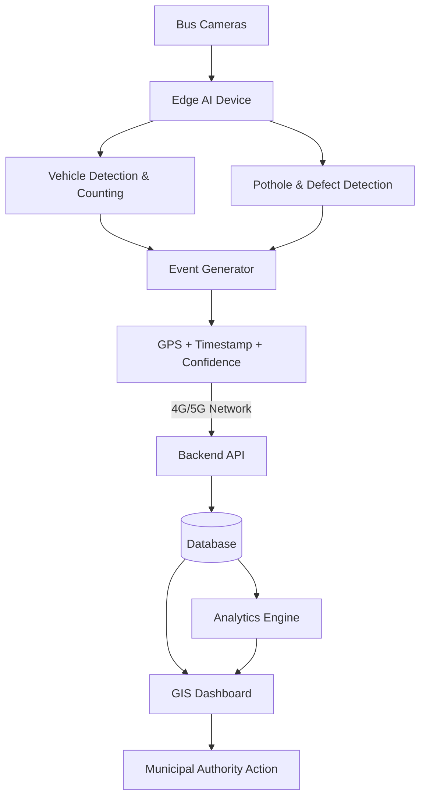

# AI-Powered Mobile Urban Intelligence Platform

> **SIH'26** · Smart India Hackathon 2026  
> **Status:** Active Development · [Live Frontend Prototype ↗](https://ai-powered-mobile-urban-intelligenc.vercel.app/)

---

## Overview

Public transport buses already travel throughout every part of a city, every single day. They carry cameras — but that video is almost entirely unused for urban sensing.

This platform transforms the existing public bus fleet into a **network of mobile AI-powered sensing units**. Bus-mounted cameras are processed using edge AI to detect road defects, traffic conditions, and other urban events. Each detection becomes a structured, geo-tagged event that is sent to a central dashboard where transport and municipal authorities can view and act on it.

---

## Problem

City authorities currently depend on:
- **Fixed CCTV cameras** — expensive to install and maintain, sparse, limited geographical coverage
- **Manual road surveys** — infrequent, labor-intensive, slow, costly
- **Citizen complaints** — reactive, incomplete, lacking standardized geographic data

There is no existing system for **continuous, city-wide, automated road and traffic sensing** at scale.

---

## Solution

Leverage the public transport buses already traversing city roads.

```
Bus Camera
    ↓
Edge AI  (runs directly on the onboard device)
    ↓
Vehicle Detection / Pothole Detection
    ↓
Event Generation
    ↓
GPS + Timestamp + Confidence
    ↓
Backend API  (cellular uplink)
    ↓
Database
    ↓
GIS Dashboard + Analytics
    ↓
Authority Action
```

By running AI inference **on the edge device**, only lightweight structured JSON events (not bandwidth-heavy raw video) are transmitted over cellular networks (4G/5G).

---

## Current MVP

The core features being developed for the SIH'26 prototype:

| # | Feature | Module Area |
|---|---------|-------------|
| 1 | Vehicle detection, classification, and counting | Traffic AI |
| 2 | Traffic density and congestion estimation | Traffic AI |
| 3 | Pothole and road-defect detection | Road AI |
| 4 | GPS + timestamp + confidence event generation | Edge / Integration |
| 5 | Centralized backend REST API + database | Backend |
| 6 | GIS dashboard with real-time event markers | Frontend |
| 7 | Traffic and road condition analytics & heatmaps | Frontend |
| 8 | Persistent / repeated defect detection across buses | Backend / Intelligence |
| 9 | Maintenance priority scoring | Backend / Intelligence |

---

## Key Intelligence Layer

Beyond simple frame-by-frame detection, the platform incorporates a **consensus-based intelligence layer**:

- **Repeated / Persistent Detection:** Multiple buses independently detect the same pothole or road defect on different runs.
- **Spatial Clustering:** The backend correlates GPS coordinates across detections (within a ~50-meter radius).
- **Hotspot Generation:** Recurring detections trigger confirmed hotspot status, eliminating false positives from single runs.
- **Maintenance Priority Scoring:** Priority score is dynamically computed from defect severity, repeat confirmation count, and route traffic density.

### Why Edge-First Processing?
- **Bandwidth Reduction:** Only compact JSON payloads (~KB) are sent instead of gigabytes of raw video.
- **Lower Latency:** Detections are converted to events in real time as the bus travels.
- **Fleet Scalability:** Central server load remains low even as hundreds of buses stream data.
- **Privacy by Design:** Raw passenger or street video never leaves the bus device.

---

## Future Scope

The following features are **NOT** part of the current MVP and will not be implemented for the initial SIH prototype:

- Waterlogging and flood depth detection
- Traffic sign detection and inventory
- Missing zebra crossings / missing dividers detection
- Pedestrian-risk detection
- Rash driving and erratic maneuver analysis
- ANPR (Automatic Number Plate Recognition)
- Hit-and-run incident reporting
- Origin–destination (OD) matrix analysis
- Advanced AI route prediction

---

## Current Development Status

| Module | Status | Notes |
|--------|--------|-------|
| Project Setup | ✅ Complete | Repository structure, issue tracking, and documentation finalized |
| Frontend Prototype | ✅ Complete | Deployed on Vercel with responsive GIS dashboard & mock data |
| Traffic AI | 🟡 In Progress | Vehicle detection, classification & counting models |
| Road Damage AI | 🟡 In Progress | Pothole and road defect detection models |
| Event Engine | 🟡 Planned | AI output to standardized schema conversion |
| Backend API | 🟡 Planned | REST endpoints (`POST /api/events`, `GET /api/events`) |
| Database | 🟡 Planned | Schema for events, hotspots, and fleet tracking |
| GIS Integration | 🟡 Planned | Connecting frontend service layer to backend API |
| Full Deployment | 🟡 Planned | End-to-end cloud pipeline deployment |

---

## Live Prototype

🔗 **[https://ai-powered-mobile-urban-intelligenc.vercel.app/](https://ai-powered-mobile-urban-intelligenc.vercel.app/)**

> ⚠️ **Note:** This is the current **frontend prototype** running on **mock/synthetic data**.  
> It establishes the user experience, GIS interface, and data contract for municipal authorities. Real edge AI models and backend services will be connected in subsequent development milestones.

---

## Architecture

### Prototype Architecture (for SIH Hackathon Demo)

```
Recorded Road / Bus Video (MP4 / Camera Feed)
        ↓
Laptop / PC  (simulated edge device)
        ↓
AI Inference  (YOLOv8 / OpenCV)
        ↓
Event Generator  (Python script attaching simulated GPS + timestamp)
        ↓
Backend API  (FastAPI / Flask)
        ↓
Database  (PostgreSQL / SQLite)
        ↓
GIS Dashboard  (React + Leaflet + Recharts)
```

### Intended Deployment Architecture (Production Fleet)

```
Bus-Mounted Cameras (HD Front/Rear)
        ↓
Edge Compute Device  (Jetson Nano / Raspberry Pi + Accelerator)
        ↓
4G / 5G Cellular Network
        ↓
Central Cloud Backend Platform
        ↓
GIS Dashboard → Municipal / Transport Authority
```

### Architecture Diagram



---

## Repository Structure

```
AI-Powered-Mobile-Urban-Intelligence/
├── frontend/               # React + Vite GIS dashboard
│   ├── src/
│   │   ├── components/     # Reusable UI: AlertPanel, MiniMap, KPICards
│   │   ├── pages/          # Overview, LiveMonitoring, Events, GIS Map, Analytics
│   │   ├── data/           # mockData.js (Centralized synthetic data)
│   │   ├── services/       # api.js (Service layer ready for backend integration)
│   │   └── layouts/        # MainLayout (Sidebar & navigation)
│   └── package.json
├── edge-ai/
│   ├── traffic-detection/  # Vehicle detection, counting & density estimation (Pranav)
│   └── pothole-detection/  # Pothole & road defect detection (Abhinandan)
├── backend/
│   ├── api/                # REST API endpoints (Arjun)
│   ├── database/           # DB schema & migrations (Arjun)
│   └── models/             # Data models / ORM entities
├── integration/
│   ├── event-generator/    # AI detection → structured event format (Parminder)
│   └── gps/                # GPS simulation & telemetry sync
├── datasets/               # Training data placeholder (gitignored)
├── docs/
│   ├── api/
│   │   └── event-schema.md # Single source of truth for event JSON contract
│   ├── architecture/
│   │   └── system-architecture.md # Detailed architecture specification
│   ├── project-management.md      # Team roles, development principles & milestones
│   ├── development-status.md      # Current module status & next deliverables
│   └── project-board.md           # Task board and issue tracking mapping
├── demo/                   # Demo video and visual assets placeholder
├── presentation/           # SIH presentation slides placeholder
├── deployment/             # Deployment configurations
├── CONTRIBUTING.md         # Git collaboration workflow & branch rules
└── requirements.txt        # Root Python dependencies
```

---

## Setup & Installation

### 1. Frontend Setup (Dashboard Prototype)

#### Prerequisites
- [Node.js](https://nodejs.org/) (v18 or higher recommended)
- `npm` or `pnpm`

#### Running Locally
```bash
# 1. Navigate to the frontend directory
cd frontend

# 2. Install dependencies
npm install

# 3. Start development server
npm run dev
```

Open your browser and navigate to **[http://localhost:5173](http://localhost:5173)**. The application will hot-reload upon changes.

#### Production Build
```bash
cd frontend
npm run build
npm run preview
```

#### Frontend Tech Stack
- **Framework:** React 18 with Vite 6
- **Styling:** Tailwind CSS v4
- **Routing:** React Router v6
- **Mapping:** Leaflet & React-Leaflet
- **Data Visualization:** Recharts
- **Icons:** Lucide React

---

### 2. Backend Setup *(Planned / In Progress)*

> 🚧 **Status:** The backend API module is currently under development.  
> Detailed setup instructions, environment variables, and virtual environment steps will be updated here upon completion of the backend milestone.

- **Planned Framework:** FastAPI (Python)
- **Database:** PostgreSQL / SQLite
- **API Contract:** Refer to [`docs/api/event-schema.md`](docs/api/event-schema.md) for endpoint contracts (`POST /api/events`, `GET /api/events`, `GET /api/hotspots`, `GET /api/analytics/summary`).

---

### 3. Edge AI & Inference Pipeline Setup *(Planned / In Progress)*

> 🚧 **Status:** AI model training and inference pipelines are currently under development.  
> Instructions for downloading model weights, running inference on recorded video clips, and streaming events will be provided here once the Edge AI module is finalized.

- **Planned Frameworks:** PyTorch, Ultralytics YOLOv8, OpenCV
- **Source Code Location:** [`edge-ai/`](edge-ai/) and [`integration/`](integration/)

---

## Team & Suggested Ownership

> **Note:** These are initial suggested ownership areas. Team members actively collaborate, cross-review code, and support integration across modules.

| Member | Primary Ownership | Core Deliverables |
|--------|-------------------|-------------------|
| **Pranav** | Traffic AI / Computer Vision | Vehicle detection, counting & density estimation |
| **Abhinandan** | ML / Road-Damage AI | Pothole detection, road defect classification & severity scoring |
| **Arjun** | Backend / Database | REST API, database schema, persistent defect clustering |
| **Advika** | Frontend / GIS | Dashboard API integration, GIS visualization & heatmaps |
| **Parminder** | Edge AI / Integration | Video ingestion pipeline, GPS simulation & event generator |
| **Team Lead** | System Integration & Coordination | Architecture, end-to-end integration, documentation, PPT & submission |

---

## Submission Requirements

| Item | Target / Format | Status |
|------|-----------------|--------|
| GitHub Repository | Source code, docs & setup instructions | ✅ Live & Updated |
| Live Prototype | Web deployment of GIS dashboard | ✅ [Live on Vercel](https://ai-powered-mobile-urban-intelligenc.vercel.app/) |
| 6-Page PPT | Official SIH presentation slide deck | 🟡 Planned (`presentation/`) |
| Demo Video | 3–5 min video walkthrough with voiceover | 🟡 Planned (`demo/`) |
| Hardware / Edge Docs | Edge architecture & simulation guide | 🟡 Documented in `docs/architecture/` |
| End-to-End Pipeline | Video → Edge AI → Backend → Dashboard | 🟡 In Progress |

---

## Documentation Index

Detailed specifications and collaboration guidelines are organized under `docs/`:

- **[Event Schema & API Contract](docs/api/event-schema.md)** — The standardized event JSON schema shared across all modules.
- **[System Architecture](docs/architecture/system-architecture.md)** — In-depth architectural design, data flows, and edge computing rationale.
- **[Project Management](docs/project-management.md)** — Team principles, role descriptions, and daily milestone roadmap.
- **[Development Status](docs/development-status.md)** — Granular tracking of module completion and active deliverables.
- **[Project Task Board](docs/project-board.md)** — Task inventory mapped to GitHub issues and priority tiers.
- **[Contributing Guidelines](CONTRIBUTING.md)** — Git workflow, branch naming rules, and pull request conventions.
