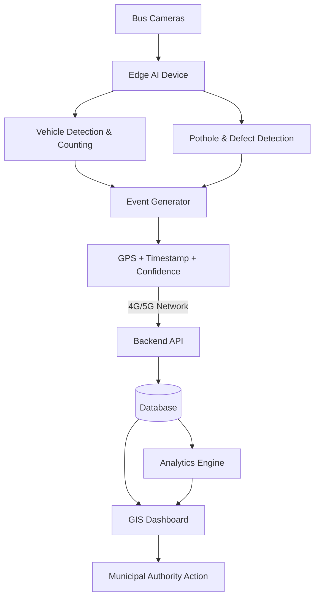

# AI-Powered Mobile Urban Intelligence Platform

> **SIH'26** · Smart India Hackathon 2026  
> **Status:** Active Development · [Live Frontend Prototype ↗](https://ai-powered-mobile-urban-intelligenc.vercel.app/)

---

## Overview

Public transport buses already travel throughout every part of a city, every single day. They carry cameras — but that video is almost entirely unused for urban sensing.

This platform transforms the existing public bus fleet into a **network of mobile AI-powered sensing units**. Bus-mounted cameras are processed using edge AI to detect road defects, traffic conditions, and other urban events. Each detection becomes a structured, geo-tagged event that is sent to a central dashboard where transport and municipal authorities can view and act on it.

---

## Problem

City authorities currently depend on:
- **Fixed CCTV cameras** — expensive to install and maintain, sparse, limited geographical coverage
- **Manual road surveys** — infrequent, labor-intensive, slow, costly
- **Citizen complaints** — reactive, incomplete, lacking standardized geographic data

There is no existing system for **continuous, city-wide, automated road and traffic sensing** at scale.

---

## Solution

Leverage the public transport buses already traversing city roads.

```
Bus Camera
    ↓
Edge AI  (runs directly on the onboard device)
    ↓
Vehicle Detection / Pothole Detection
    ↓
Event Generation
    ↓
GPS + Timestamp + Confidence
    ↓
Backend API  (cellular uplink)
    ↓
Database
    ↓
GIS Dashboard + Analytics
    ↓
Authority Action
```

By running AI inference **on the edge device**, only lightweight structured JSON events (not bandwidth-heavy raw video) are transmitted over cellular networks (4G/5G).

---

## Current MVP

The core features developed for the SIH'26 prototype:

| # | Feature | Module Area | Status |
|---|---------|-------------|--------|
| 1 | Vehicle detection, classification, and counting | Traffic AI | ✅ Complete (PR #29) |
| 2 | Traffic density and congestion estimation | Traffic AI | ✅ Complete (PR #29) |
| 3 | Pothole and road-defect detection | Road AI | 🟡 In Progress |
| 4 | GPS + timestamp + confidence event generation | Edge / Integration | ✅ Complete (PR #31) |
| 5 | Centralized backend REST API + database | Backend | ✅ Complete (PR #30, #32) |
| 6 | Persistent / repeated defect detection (50m clustering) | Backend / Intelligence | ✅ Complete (PR #32) |
| 7 | Maintenance priority scoring formula | Backend / Intelligence | ✅ Complete (PR #32) |
| 8 | GIS dashboard with real-time event markers | Frontend | ✅ Complete (Prototype Live) |
| 9 | Traffic and road condition analytics & heatmaps | Frontend | ✅ Complete (Prototype Live) |

---

## Key Intelligence Layer

Beyond simple frame-by-frame detection, the platform incorporates a **consensus-based intelligence layer**:

- **Repeated / Persistent Detection:** Multiple buses independently detect the same pothole or road defect on different passes.
- **Spatial Clustering:** The backend correlates GPS coordinates across detections (within a 50-meter radius using Haversine distance in `backend/app/services/hotspot_service.py`).
- **Hotspot Generation:** Recurring detections trigger confirmed hotspot status, eliminating false positives from single runs.
- **Maintenance Priority Scoring:** Priority score is dynamically computed:  
  $$\text{Priority Score} = f(\text{Severity}, \text{Repeat Count}, \text{Traffic Density})$$

### Why Edge-First Processing?
- **Bandwidth Reduction:** Only compact JSON payloads (~KB) are sent instead of gigabytes of raw video.
- **Lower Latency:** Detections are converted to events in real time as the bus travels.
- **Fleet Scalability:** Central server load remains low even as hundreds of buses stream data.
- **Privacy by Design:** Raw passenger or street video never leaves the bus device.

---

## Future Scope

The following features are **NOT** part of the current MVP and will not be implemented for the initial SIH prototype:

- Waterlogging and flood depth detection
- Traffic sign detection and inventory
- Missing zebra crossings / missing dividers detection
- Pedestrian-risk detection
- Rash driving and erratic maneuver analysis
- ANPR (Automatic Number Plate Recognition)
- Hit-and-run incident reporting
- Origin–destination (OD) matrix analysis
- Advanced AI route prediction

---

## Current Development Status

| Module | Status | Resolved Tasks | Notes |
|--------|--------|----------------|-------|
| Project Setup | ✅ Complete | #24 | Repository structure, issue tracking, and documentation finalized |
| Frontend Prototype | ✅ Complete | #12 | Deployed on Vercel with responsive GIS dashboard & mock data |
| Traffic AI | ✅ Complete | #1, #2, #3 | YOLOv8 vehicle detection, SORT tracking, line counting & density (PR #29) |
| Backend API & DB | ✅ Complete | #7, #8, #9, #10, #11, #21, #22 | FastAPI server, SQLite/Postgres DB, 50m spatial clustering (PR #30, #32) |
| Edge Pipeline | ✅ Complete | #16, #17, #18, #19, #20 | Video ingestion, GPS simulation, HTTP event streamer (PR #31) |
| Road Damage AI | 🟡 In Progress | — | Pothole and road defect detection models (#4, #5, #6) |
| Frontend API Sync | 🟡 In Progress | — | Connecting frontend service layer to live backend API (#13, #14, #15) |
| Full Deployment | 🟡 Planned | — | Cloud deployment of backend + DB connected to Vercel (#27) |

---

## Live Prototype

🔗 **[https://ai-powered-mobile-urban-intelligenc.vercel.app/](https://ai-powered-mobile-urban-intelligenc.vercel.app/)**

> ⚠️ **Note:** This is the current **frontend prototype** running on **mock/synthetic data**.  
> It establishes the user experience, GIS interface, and data contract for municipal authorities. Real edge AI models and backend services will be connected in subsequent development milestones.

---

## Architecture

### Prototype Architecture (for SIH Hackathon Demo)

```
Recorded Road / Bus Video (MP4 / Camera Feed)
        ↓
Laptop / PC  (simulated edge device)
        ↓
AI Inference  (YOLOv8 / OpenCV)
        ↓
Event Generator  (Python script attaching simulated GPS + timestamp)
        ↓
Backend API  (FastAPI / Uvicorn @ port 8000)
        ↓
Database  (SQLite / PostgreSQL)
        ↓
GIS Dashboard  (React + Leaflet + Recharts)
```

### Intended Deployment Architecture (Production Fleet)

```
Bus-Mounted Cameras (HD Front/Rear)
        ↓
Edge Compute Device  (Jetson Nano / Raspberry Pi + Accelerator)
        ↓
4G / 5G Cellular Network
        ↓
Central Cloud Backend Platform
        ↓
GIS Dashboard → Municipal / Transport Authority
```

### Architecture Diagram



---

## Repository Structure

```
AI-Powered-Mobile-Urban-Intelligence/
├── frontend/               # React + Vite GIS dashboard
│   ├── src/
│   │   ├── components/     # Reusable UI: AlertPanel, MiniMap, KPICards
│   │   ├── pages/          # Overview, LiveMonitoring, Events, GIS Map, Analytics
│   │   ├── data/           # mockData.js (Centralized synthetic data)
│   │   ├── services/       # api.js (Service layer ready for backend integration)
│   │   └── layouts/        # MainLayout (Sidebar & navigation)
│   └── package.json
├── backend/                # FastAPI Backend & Database Engine
│   ├── app/
│   │   ├── routers/        # /api/events, /api/buses, /api/analytics, /api/hotspots
│   │   ├── models/         # SQLAlchemy models: Event, Bus, Hotspot, Alert
│   │   ├── schemas/        # Pydantic validation schemas
│   │   ├── services/       # hotspot_service.py (50m spatial clustering)
│   │   ├── database.py     # DB session & auto-migration
│   │   ├── seed.py         # Fleet and event seed data
│   │   └── main.py         # FastAPI application entry point
│   ├── tests/              # Backend API & integration tests
│   └── requirements.txt
├── edge-ai/
│   ├── traffic-detection/  # YOLOv8 detection, SORT tracking & density estimation (Pranav)
│   │   ├── detector.py     # Vehicle detection & NMS
│   │   ├── tracker.py      # SORT Kalman tracker
│   │   ├── counter.py      # Directional line-crossing counter
│   │   ├── density_estimator.py # Density classification & live HUD
│   │   ├── pipeline.py     # Main video pipeline orchestrator
│   │   └── run.py          # Standalone CLI runner
│   └── pothole-detection/  # Pothole & road defect detection (Abhinandan)
├── integration/            # End-to-End Pipeline & Simulation (Parminder)
│   ├── event-generator/    # Standardized EventGenerator wrapper
│   ├── gps/                # GPS trajectory simulator (sample_route.csv)
│   ├── run_traffic_pipeline.py # Live video stream -> GPS -> Backend runner
│   └── test_pipeline.py    # Pipeline integration smoke test
├── datasets/               # Training data placeholder (gitignored)
├── docs/
│   ├── api/
│   │   └── event-schema.md # Single source of truth for event JSON contract
│   ├── architecture/
│   │   ├── system-architecture.md # Detailed architecture specification
│   │   └── integration-layer.md   # Integration layer & pipeline guide
│   ├── models/
│   │   └── traffic-ai.md          # Full documentation for Traffic AI module
│   ├── project-management.md      # Team roles, development principles & milestones
│   ├── development-status.md      # Current module status & next deliverables
│   └── project-board.md           # Task board and issue tracking mapping
├── demo/                   # Demo video and visual assets placeholder
├── presentation/           # SIH presentation slides placeholder
├── deployment/             # Deployment configurations
├── CONTRIBUTING.md         # Git collaboration workflow & branch rules
└── requirements.txt        # Root Python dependencies
```

---

## Setup & Installation

### 1. Frontend Dashboard Setup

```bash
cd frontend
npm install
npm run dev
```
Open **[http://localhost:5173](http://localhost:5173)** in your browser.

---

### 2. Backend Server Setup

```bash
cd backend
pip install -r requirements.txt
uvicorn app.main:app --reload --port 8000
```
- Interactive Swagger API docs: **[http://localhost:8000/docs](http://localhost:8000/docs)**
- Health check endpoint: **[http://localhost:8000/health](http://localhost:8000/health)**
- Events endpoint: **[http://localhost:8000/api/events](http://localhost:8000/api/events)**

---

### 3. Traffic AI & End-to-End Pipeline

#### Run Standalone Traffic AI (Webcam / Video)
```bash
cd edge-ai/traffic-detection
pip install -r requirements.txt
python run.py --source 0 --show
```

#### Run End-to-End Streamer (AI + GPS -> Backend)
```bash
# In project root with backend running:
python integration/run_traffic_pipeline.py --source 0 --backend-url http://localhost:8000/api/events --bus-id BUS-001
```

---

## Team & Suggested Ownership

> **Note:** These are initial suggested ownership areas. Team members actively collaborate, cross-review code, and support integration across modules.

| Member | Primary Ownership | Core Deliverables | Status |
|--------|-------------------|-------------------|--------|
| **Pranav** | Traffic AI / Computer Vision | Vehicle detection, counting & density estimation | ✅ Completed (PR #29) |
| **Arjun** | Backend / Database | REST API, database schema, persistent defect clustering | ✅ Completed (PR #30, #32) |
| **Parminder** | Edge AI / Integration | Video ingestion pipeline, GPS simulation & event generator | ✅ Completed (PR #31) |
| **Advika** | Frontend / GIS | Dashboard API integration, GIS visualization & heatmaps | 🟡 In Progress (Prototype Live) |
| **Abhinandan** | ML / Road-Damage AI | Pothole detection, road defect classification & severity scoring | 🟡 In Progress |
| **Team Lead** | System Integration & Coordination | Architecture, end-to-end integration, documentation, PPT & submission | 🟡 In Progress |

---

## Submission Requirements

| Item | Target / Format | Status |
|------|-----------------|--------|
| GitHub Repository | Source code, docs & setup instructions | ✅ Live & Updated |
| Live Prototype | Web deployment of GIS dashboard | ✅ [Live on Vercel](https://ai-powered-mobile-urban-intelligenc.vercel.app/) |
| Traffic AI Pipeline | Live vehicle detection & density stream | ✅ [Implemented](docs/models/traffic-ai.md) |
| Backend Engine & DB | FastAPI + SQLite/Postgres + Clustering | ✅ [Implemented](backend/) |
| End-to-End Pipeline | Video → Edge AI → GPS → Backend | ✅ [Implemented](docs/architecture/integration-layer.md) |
| 6-Page PPT | Official SIH presentation slide deck | 🟡 Planned (`presentation/`) |
| Demo Video | 3–5 min video walkthrough with voiceover | 🟡 Planned (`demo/`) |
| Final Audit | Repository audit & rehearsal | 🟡 Planned |

---

## Documentation Index

Detailed specifications and collaboration guidelines are organized under `docs/`:

- **[Event Schema & API Contract](docs/api/event-schema.md)** — The standardized event JSON schema shared across all modules.
- **[System Architecture](docs/architecture/system-architecture.md)** — In-depth architectural design, data flows, and edge computing rationale.
- **[Integration Layer Guide](docs/architecture/integration-layer.md)** — End-to-end pipeline runner and GPS simulation guide.
- **[Traffic AI Module Documentation](docs/models/traffic-ai.md)** — Full specification and parameters for the Vehicle AI pipeline.
- **[Project Management](docs/project-management.md)** — Team principles, role descriptions, and daily milestone roadmap.
- **[Development Status](docs/development-status.md)** — Granular tracking of module completion and active deliverables.
- **[Project Task Board](docs/project-board.md)** — Task inventory mapped to GitHub issues, status, and resolution details.
- **[Contributing Guidelines](CONTRIBUTING.md)** — Git workflow, branch naming rules, and pull request conventions.
