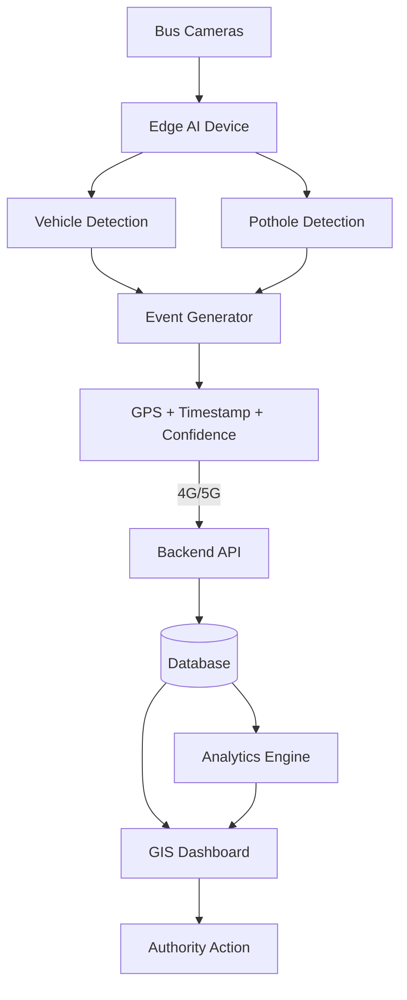

# System Architecture

> This document describes the architecture of the AI-Powered Mobile Urban Intelligence Platform for SIH'26.

---

## Why Edge Processing?

Instead of streaming raw video from buses to a central server:

| Approach | Bandwidth | Latency | Scalability |
|----------|-----------|---------|-------------|
| Raw video stream | Very High | High | Poor |
| **Edge AI + Event upload** | **Very Low** | **Low** | **Excellent** |

Edge processing means:
- AI inference runs **on the bus device**, not in the cloud
- Only small structured JSON events are sent over 4G/5G
- A fleet of 100 buses generates ~KB/s of data, not TB/day of video
- Raw video never leaves the bus, preserving privacy
- The system scales linearly with fleet size

---

## Prototype Architecture

> For SIH'26, we simulate the bus with a laptop/PC since physical bus hardware is unavailable.

```
Recorded Road / Bus Video (MP4 / webcam)
        ↓
Laptop / PC  ← Simulated edge device
        ↓
AI Inference  (YOLOv8 / custom model)
        │
        ├── Vehicle Detection → vehicle count, class, density
        └── Pothole Detection → bounding box, size, severity
        ↓
Event Generator (Python)
        │
        ├── Attaches GPS (simulated from CSV or hardcoded)
        ├── Attaches timestamp (current UTC)
        ├── Assigns event_id
        └── Computes severity from confidence + size
        ↓
POST /api/events  → Backend API
        ↓
Database (PostgreSQL / SQLite)
        ↓
GET /api/events  ← Frontend Dashboard
        ↓
GIS Map + Analytics (React + Leaflet)
```

---

## Intended Deployment Architecture

> This is what the platform would look like when deployed on real buses.

```
Bus-Mounted Cameras (HD)
        ↓
Edge Compute Device  (Jetson Nano / Raspberry Pi 4 + Coral TPU)
        │
        ├── Real-time AI inference at 15-30 FPS
        ├── GPS module (USB or serial)
        └── 4G/5G modem
        ↓
4G / 5G Network  (cellular uplink)
        ↓
Central Cloud Backend  (FastAPI + PostgreSQL)
        │
        ├── Event ingestion + storage
        ├── Persistent detection logic
        ├── Hotspot generation
        └── Maintenance priority scoring
        ↓
GIS Dashboard  (React + Leaflet)
        ↓
Municipal / Transport Authority
```

---

## Architecture Diagram



---

## Component Breakdown

### 1. Edge AI Module

**Owner:** Pranav (Traffic AI) + Abhinandan (Road AI)

| Component | Description |
|-----------|-------------|
| Input | Video frames from bus camera |
| Processing | YOLOv8 or equivalent detection model |
| Traffic output | Vehicle count, class distribution, density estimate |
| Road output | Pothole bounding box, severity, road defect classification |
| Output format | Python dict matching the event schema |

---

### 2. Event Generator

**Owner:** Parminder

| Component | Description |
|-----------|-------------|
| Input | AI module detection dict |
| Processing | Attach GPS, timestamp, generate event_id, threshold confidence |
| Output | Complete event object (see `docs/api/event-schema.md`) |
| Transport | HTTP POST to Backend API |

---

### 3. Backend API

**Owner:** Arjun

| Component | Description |
|-----------|-------------|
| Framework | FastAPI (Python) or Flask |
| Input | JSON events from integration layer |
| Storage | PostgreSQL (production) / SQLite (prototype) |
| Key logic | Persistent detection (cluster events by GPS radius) |
| Key logic | Maintenance priority scoring |
| Output | REST API consumed by frontend |

**Minimum endpoints:**

```
POST /api/events         → Ingest new event
GET  /api/events         → List all events (filterable)
GET  /api/events/{id}    → Single event detail
GET  /api/analytics/summary → Counts, severity breakdown
GET  /api/hotspots       → Persistent/repeated detections
```

---

### 4. Frontend / GIS Dashboard

**Owner:** Advika

| Component | Description |
|-----------|-------------|
| Framework | React + Vite |
| Mapping | React-Leaflet |
| Charts | Recharts |
| Current state | Fully built prototype with mock data |
| Next step | Replace `src/services/api.js` mock calls with real backend calls |

**To connect frontend to backend:**
1. Set `VITE_API_BASE_URL` in `.env`
2. Update `src/services/api.js` to use `fetch(import.meta.env.VITE_API_BASE_URL + '/api/events')`
3. Remove mock data imports

---

## Persistent Detection Logic

This is a key intelligence feature of the platform.

When the backend receives events:

1. It checks if a new event's GPS coordinates fall within **50 metres** of any existing event of the same type
2. If yes, it increments the `repeated_detections` counter for that location cluster
3. Locations with `repeated_detections >= 3` are marked as **hotspots**
4. Hotspots receive a higher **maintenance priority score**
5. The dashboard displays hotspot circles on the GIS map

This ensures that a single bus reporting a pothole once is treated differently from six buses independently confirming the same pothole.

---

## Data Flow Summary

```
[Bus Camera]
    → [Edge AI: detect]
    → [Event Generator: structure + GPS + timestamp]
    → [Backend: store + cluster + score]
    → [Database: persist]
    → [Frontend: fetch + display on GIS map]
    → [Authority: view + act]
```

